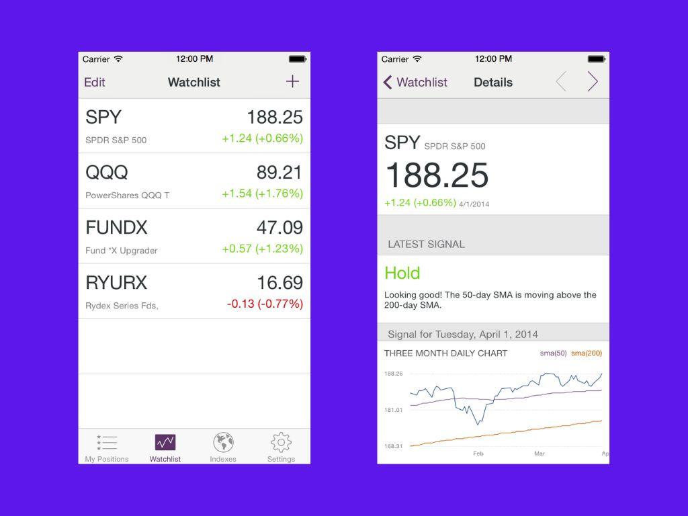

# Mutual Fund Signals

**Status: Archived Project**

Mutual Fund Signals (codenamed "Mercury") is an iOS application for tracking mutual funds, ETFs, and market indexes. The app provides users with market signals based on simple moving average analysis to help make informed investment decisions.

## Features

- **Portfolio Tracking**: Organize investments into three categories - My Positions, My Watchlist, and My Indexes
- **Real-time Data**: Live price updates and market data from Yahoo Finance
- **Interactive Charts**: Historical price charts with simple moving average overlays
- **Market Signals**: Bullish/bearish signals based on SMA crossovers with visual buy/sell/hold indicators
- **Guided Experience**: Built-in tutorials explaining different market signals and trading concepts

## Technical Overview

**Platform**: iOS (iOS 7.0+)  
**Language**: Objective-C  
**Build System**: Xcode with CocoaPods dependency management  

### Architecture
- **MVC Pattern**: Traditional iOS Model-View-Controller architecture
- **Singleton Data Manager**: Centralized data handling with local caching
- **Yahoo Finance Integration**: Real-time market data via CSV API endpoints
- **Chart Rendering**: Custom line charts with technical indicator overlays

### Key Dependencies
- **AFNetworking 2.0**: HTTP networking and API communication
- **ios-linechart**: Interactive chart rendering
- **CHCSVParser**: Yahoo Finance CSV data parsing
- **MBProgressHUD**: Loading indicators and user feedback

### Signal Algorithm
The app calculates trading signals using simple moving average (SMA) crossovers:
- Tracks multiple SMA periods for trend analysis
- Generates buy/sell/hold recommendations
- Provides visual indicators for market sentiment

## Screenshots

See the [Screenshots](./Screenshots) directory for additional app screenshots and interface examples.

---

*This project is archived and no longer actively maintained. It serves as a showcase of iOS financial app development using Objective-C and traditional MVC architecture.*
